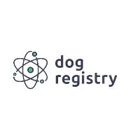
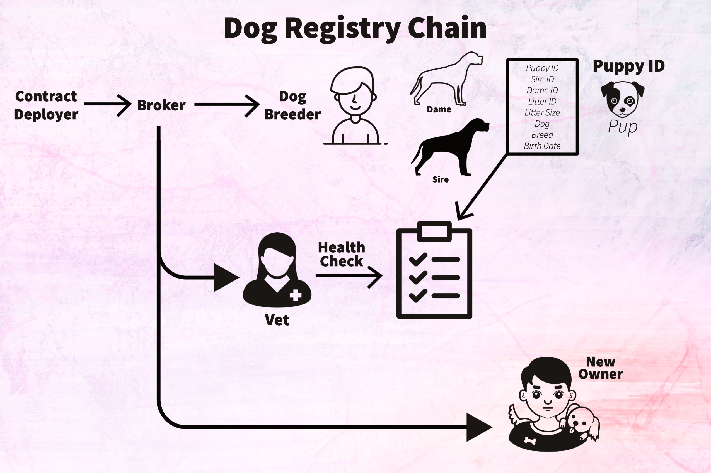
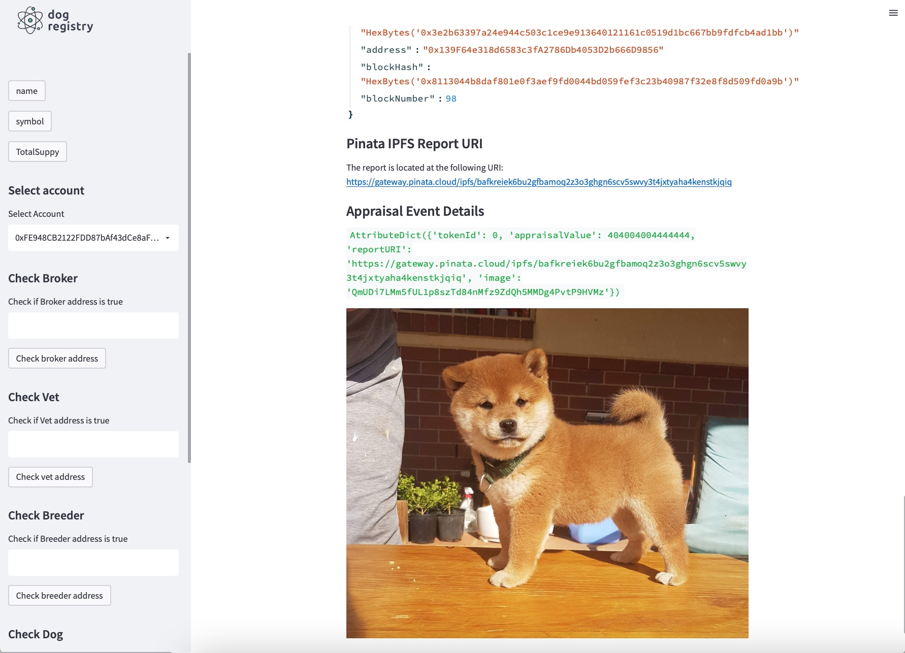

# Dog Registry Blockchain Application 



## Table of Contents
1. [Project Outline](#project-outline)
2. [Benefits of using our Dapp Vs Centralized registry application](#benefits-of-using-our-dapp-vs-centralized-registry-dog-applications)
3. [How our application works](#how-our-application-works)
4. [Step 1: Preparation steps before testing the dapp locally](#step-1-preparation-steps-before-testing-the-dapp-locally)
5. [Step 2: Running the application](#step-2-running-the-application)
6. [Step 3: Navigating through the app](#step-3-navigating-through-the-app)
7. [Improvements](#improvements)
8. [Summary](#summary)

## Project Outline
The goal of our dog registration application is to increase the confidence of dog owners in the genetic history of their dogs while supporting responsible breeders, veterinarians, and sales agreements.

 The [American Kennel Club](https://www.akc.org/) has maintained a registry of pure breed dogs since 1884 as a means of maintaining the integrity of breed lineages and the integrity of those involved in dog breeding. The AKC is an advocate for pure breed dog ownership, canine health, and promotion of responsible dog ownership and breeding. Currently, the AKC maintains paper and electronic breed records that are held in central authority. Persons who wish to breed their dogs must pay fees to register the sire, the dame, and the resulting litter of puppies. Further fees are paid for registration of health, genetics, sale, and ownership. Each certification is held separately, fees are charged to access each record. See: https://www.akc.org/register/.
 
## Benefits of using our Dapp Vs. Centralized Registry Dog applications

The application that we have developed uses smart contracts and blockchain technology to verify and store dog registry data on a blockchain contract. 

Benefits of using a decentralized application (DAPP) compared to traditional dog registries: 
- Verify dog breed lineage easily
- Prevent fraud activities
- Improve transparancy
- Realtime accounting
- Cost reduction for registrations
- Imutability
- Decentralized ledger accessible to the public
- Increased trust in record keeping
- Programable sytstem

The registry dapp tracks a puppy from broker to new owner in a single, immortal, blockchain smart contract that is accessable to all key actors in the process. For each litter the blockchain record has relavent identities, certifications and information (Figure 1). The broker or kennel club, certifys a veterinarian, and buyer/ owner are also recorded along with the certifications given by each entity. 

This blockchain application introduces a heretofore unprecedented level of transparency to dog breeding and increases the confidence of dog owners in the veracity of breeding information while supporting responsible breeders, veterinarians, and brokers.



## How our application works

This application `app.py` is a front end that allows you to interact with a backend smart contract deployed on a test ethereum network.

### Step 1: Preparation steps before testing the dapp locally

1. Set up **Ganache** for a blockchain environment
2. Import ganache account to your metamask using the provided private keys
3. Import `DogNFT.sol` and `DogRegistry.sol` to Remix IDE 
4. Compile and Deploy `DogRegistry.sol`  using injected metamask on Remix IDE
5. Copy the deployed smart contract address into your `.env` environment
6. Add pinata keys to `.env` file. 

> **Note**
Use SAMPLE.env file as a template and change the file name from `SAMPLE.env` to `.env` after adding your pinata keys and deployed contract address.

### Step 2: Running the application

Make sure you still have ganache open and running and proceed to run the `app.py` application. 

The application requires streamlit installed so if you don't have it installed, use `pip install streamlit` from your Terminal and then proceed.

Use terminal to `cd` into the `dog-registry-blockchain-app/` directory and use streamlit to run the `app.py` with the following command.

```
streamlit run app.py
```

### Step 3: Navigating through the app

Use the select accounts on the sidebar panel to select the account that will be executing function calls on the smart contract. 

- Step 1 : Add Broker
    - The contract deployer can assign a broker role account by calling the `addBroker` to add broker address and a broker Id
    - The broker role has the ability to add a veterinary doctor by calling the `addVeterinaryDoctor` function
    - The broker role has the ability to add a dog breeder by calling the `addDogBreeder` function
    - To check if an address is a broker call `isBroker` and provide an ethereum address
- Step 2: Add Veterinary Doctor
    - Only addresses with a broker role can add a new veterinary doctor by calling `addVeterinaryDoctor` function
    - The Veterinary doctor is the only role that can add a health report for a reigstered puppy by calling `addPuppyReport` function
    - To check if an address is a veterinary doctor call `isVeterinaryDoctor` and provide an ethereum address
- Step 3: Add Dog Breeder
    - The broker role is the only role that can add a dog breeder by calling `addDogBreeder` function
    - The dog breeder role has the ability to register a puppy by calling `registerDog` or `addDog` functions
    - To check if an address is a dog breeder call `isDogBreeder` and provide an ethereum address
- Step 4: Register Dog
    - Only addresses with a dog breeder role can call `registerDog` to register a puppy. 
    - To register Dog provide a `dog_owner` address, `name`, `breed`, `dame`, `sire`, `initialAppraisalValue`, `litterID`, `litterSize`, `birthDate`, then upload an `image` on the front end to generate a `tokenURI` and `tokenJSON` uploaded through pinata ipfs. 
    - The `registerDog` is a function from [Dog NFT smart contract](./contracts/DogNFT.sol) smart contract to register a dog via an ERC721 NFT token
    - Produces an NFT for the puppy.
        - The owner recieves a non-fungible token (NFT) unique to their new dog along with access to the breeding and health records.
- Step 5: Add Puppy Health Records
    - A veterinary doctor role can add puppy health record by calling `addPuppyReport` function
    - The front end provides inputs to call the contract funtion via text inputs
- Step 6: Appraise Dog
    - Only addresses assigned a token id belonging to a puppy NFT can appraise the the puppy's value by calling `Appraisal` function
    - The front end provide an input for a token ID, new appraisal amount and details for the appraisal report
    - There is also a funtion `ownerOf` that takes in a token Id `uint` value to check the current owner of the NFT DOG token
- Step 7: Get the appraisal report History
    - The front end application provides one `uint` input for a token ID
    - When you click the 'get appraisal report' button, we a checking for contract events from the `Appraisal` function
    - We are also using the token ID as a filter by adding `.createFilter` to get the appraisal reports for the token

When you complete all the steps you should be able to view the NFT of the DOG token like shown in the figure below.



## Improvements

- Create marketplace functionalities for our dog registry system
    - Our next feature would be to add a marketplace to conduct sales for registered puppies
    - Add functionalities to bid for NFT tokens

## Summary

- Our final project presentation for University of Minnesota Fintect Bootcamp. 
    - Here's a presentation to go along with this project
- Collaborators
    - [Meek Msaki](https://github.com/mmsaki)
    - [Richard Melvin](https://github.com/rgmelvin)
    - [Kyle Plathe](https://github.com/kyleplathe)