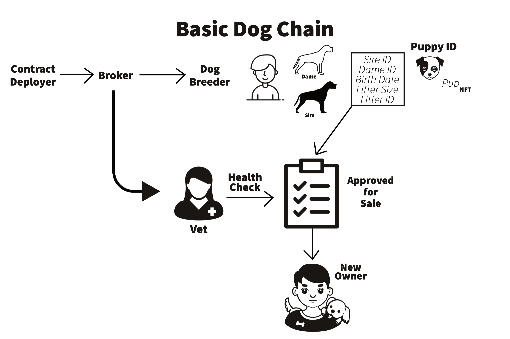

# dog-registry-blockchain-app
The goal of our dog registration application is to increase the confidence of dog owners in the genetic history of their dogs while supporting responsible breeders, veterinarians, and sales agreements.

 The American Kennel Club (https://www.akc.org/) has maintained a registry of pure breed dogs since 1884 as a means of maintaining the integrity of breed lineages and the integrity of those involved in dog breeding. The AKC is an advocate for pure breed dog ownership, canine health, and promotion of responsible dog ownership and breeding. Currently, the AKC maintains paper and electronic breed records that are held in central authority. Persons who wish to breed their dogs must pay fees to register the sire, the dame, and the resulting litter of puppies. Further fees are paid for registration of health, genetics, sale, and ownership. Each certification is held separately, fees are charged to access each record. See: https://www.akc.org/register/.
 
The dApp that we have developed uses smart contracts and blockchain technology to verify and store dog registry data on a ERC20 blockchain contract. 

The registry dApp tracks the litters produced from a single dame in a single, immortal blockchain that is accessable to all key actors in the process. For each litter the blockchain records: dame, sire, litter size, health of the puppies, sale of the litter, and buyer/ owner of the litter (Figure 1). The breeder, certifying veterinarian, sale broker, and buyer/ owner are also recorded along with the certifications given by each.

This blockchain application introduces a heretofore unprecedented level of transparency to dog breeding and increases the confidence of dog owners in the veracity of breeding information while supporting responsible breeders, veterinarians, and brokers.

## Figure 1. Outline of the Dog Registry dApp.
